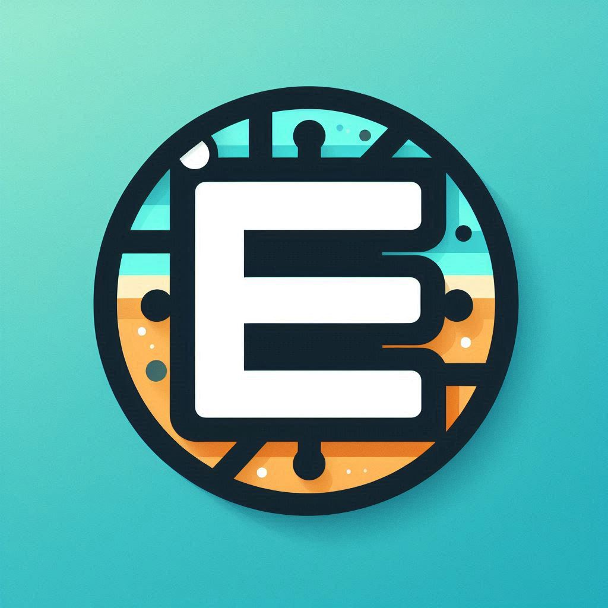

        

Everything Web, Blockchain & Web3, FinTech

 
<h2>About Me:</h2>
    <ul>
        <li>🔭 I'm currently working on <strong>AI Trading Bot</strong></li>
        <li>🌱 I'm currently studying <strong>Graduate Certificate at Queensland University of Technology</strong></li>
        <li>👯 I'm looking to collaborate on <strong>anything you need from below tech stacks</strong></li>
        <li>📫 Message me on 
        </li>
    </ul>
    
 
<h2>💻 Tech Stack:</h2>
    
<h3>Web Development:</h3>

        
        
        
        

<h3>Blockchain:</h3>

        
        
  

<h3>AI & Machine Learning:</h3>

        
        
        
        
        
        
        
        
        
        

<h3>Frameworks, Platforms & Libraries:</h3>

        
        
        
        
        
        
        
        
        
        
        
        
        
        

<h3>Databases / ORM:</h3>

        
        
        
        

<h3>Other:</h3>

        
        
        
        
        
        
        
        
        
        
        
        
        

 
<h2> GitHub Stats:</h2>

    
    <!--  
    
     
     -->

 
<h2> Top Contributed Repo</h2>

        

 

        

